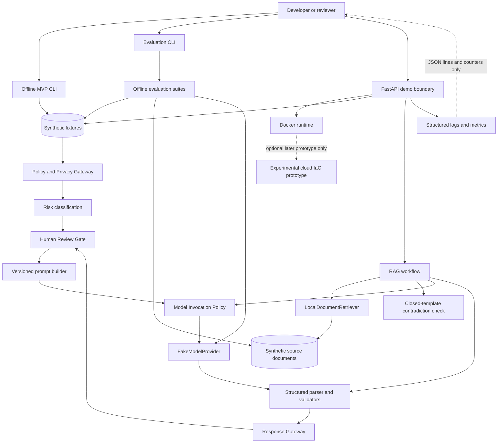

# Architecture Diagram

## Scope

This diagram describes the synthetic offline MVP plus experiment-branch demo
surfaces. It does not describe a productive Steuerberatung system and does not
claim an accepted reference-cloud selection.

## Dataflow

1. CLI, evaluation CLI, and FastAPI demo receive only synthetic fixture IDs or
   local synthetic evaluation cases.
2. Gateway, risk classification, and Human Review Gate run before model
   invocation.
3. Prompt text is built inside the workflow boundary and is not returned by API
   responses.
4. Standard tests and demos use `FakeModelProvider`.
5. RAG uses local synthetic source documents and local retrieval.
6. Contradiction checks use a closed deterministic template extractor over
   natural synthetic passages; they are not general semantic NLP.
7. Freshness checks, where used in evaluation, rely on supersession and explicit
   validity windows rather than treating past start dates as outdated.
8. Parsers, validators, and response gateway checks run before draft material is
   exposed.
9. Observability emits structured metadata and counters, not raw prompts, raw
   model payloads, secrets, or real data.

## Threat and failure boundaries

| Boundary | Purpose | Failure handling |
| --- | --- | --- |
| Gateway | Stop disallowed or privacy-sensitive synthetic inputs before continuation. | Restrictive decision and Human Review visibility. |
| Human Review Gate | Prevent automatic continuation for elevated internal risk classes. | No productive action; draft material remains review-bound. |
| Model Invocation Policy | Enforce prompt identity, version, and size limits. | Policy errors stay separate from provider errors. |
| Parser and validators | Reject malformed or semantically invalid structured output. | Error path without raw prompt or response disclosure. |
| RAG evidence boundary | Keep source use local and synthetic with citations. | Abstention or uncertainty when evidence is missing. |
| Contradiction boundary | Flag closed-template attribute conflicts in retrieved synthetic passages. | Skip provider call and expose contradiction flag. |
| API boundary | Adapt workflows to HTTP for demo only. | HTTP error translation without full prompt exposure. |
| Observability boundary | Emit runtime metadata for review. | No prompts, secrets, model payloads, or real data in log events. |
| Experimental cloud IaC | Optional later prototype after cloud comparison. | Not an accepted architecture decision on this branch. |

## Non-goals

The architecture does not include productive data paths, DATEV, Agenda, ELSTER,
banking, email, autonomous tax decisions, automatic submissions, Multi-Cloud
support, accepted Azure lock-in on this branch, or productive tax advice.
